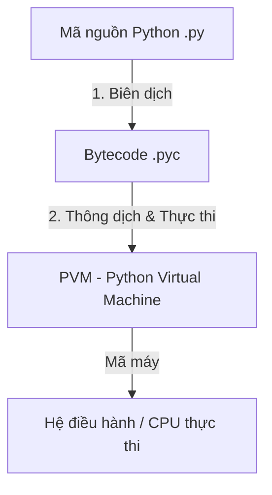

# Python: Tổng quan về Ngôn ngữ và Các Khái niệm Cơ bản

Tài liệu này cung cấp lời giải chi tiết cho các câu hỏi lý thuyết cơ bản về ngôn ngữ lập trình Python, bao gồm cơ chế hoạt động, các kiểu dữ liệu, toán tử, cấu trúc điều khiển và kiểu dữ liệu Boolean.

---

## Bài 1: Python là ngôn ngữ thông dịch hay biên dịch? Tại sao?

Python thường được gọi là **ngôn ngữ thông dịch (interpreted language)**, tuy nhiên trên thực tế, nó là sự kết hợp của **cả biên dịch (compilation) và thông dịch (interpretation)**.

### 1. Cơ chế hoạt động của Python

Khi bạn chạy một chương trình Python (ví dụ: `python main.py`), quá trình xử lý diễn ra qua hai giai đoạn chính:



1. **Giai đoạn Biên dịch (Compilation):**
   * Trình biên dịch của Python đầu tiên sẽ đọc mã nguồn `.py` và kiểm tra cú pháp.
   * Nếu không có lỗi, nó sẽ dịch mã nguồn này thành một dạng mã trung gian gọi là **Bytecode** (lưu trữ dưới dạng các file `.pyc` trong thư mục `__pycache__`).
   * Bytecode là mã tối ưu cấp thấp, độc lập với nền tảng phần cứng nhưng máy tính chưa thể chạy trực tiếp được.

2. **Giai đoạn Thông dịch (Interpretation):**
   * Bytecode được chuyển sang **Python Virtual Machine (PVM)** (Máy ảo Python).
   * PVM là một trình thông dịch (interpreter). Nó sẽ đọc từng dòng Bytecode, chuyển đổi chúng thành **mã máy (machine code)** của hệ điều hành hiện tại và thực thi ngay lập tức.

---

### 2. Tại sao Python thường được gọi là ngôn ngữ thông dịch?

Mặc dù có bước biên dịch sang Bytecode, Python vẫn được phân loại là ngôn ngữ thông dịch vì các lý do sau:

* **Tự động và ẩn dưới nền (Transparent Compilation):** Quá trình dịch từ mã nguồn sang Bytecode diễn ra hoàn toàn tự động khi ta chạy file. Lập trình viên không cần thực hiện bước build/compile thủ công để tạo ra file thực thi độc lập (như `.exe` trong C/C++ hay `.class` trong Java).
* **Thực thi từng dòng (Line-by-line Execution):** PVM dịch và thực thi Bytecode theo từng câu lệnh tại thời điểm chạy chương trình (runtime).
* **Phát hiện lỗi khi chạy:** Các lỗi logic hoặc lỗi kiểu dữ liệu (TypeError, NameError,...) thường chỉ được phát hiện khi chương trình chạy tới dòng code đó, thay vì phát hiện trước khi chạy như các ngôn ngữ biên dịch thuần túy.

---

## Bài 2: Liệt kê các thành phần cơ bản trong Python

### 1. Các kiểu dữ liệu trong Python (Data Types)

Python là ngôn ngữ có **kiểu dữ liệu động (dynamically typed)**, nghĩa là bạn không cần khai báo kiểu dữ liệu của biến trước mà Python sẽ tự động nhận diện khi gán giá trị.

| Nhóm kiểu dữ liệu | Tên kiểu dữ liệu | Ký hiệu trong Python | Ví dụ |
| :--- | :--- | :--- | :--- |
| **Kiểu số (Numeric)** | Số nguyên | `int` | `x = 10`, `y = -5` |
| | Số thực | `float` | `pi = 3.14`, `g = 9.8` |
| | Số phức | `complex` | `z = 2 + 3j` |
| **Kiểu chuỗi (Sequence)** | Chuỗi ký tự | `str` | `name = "HIT Python"` |
| | Danh sách (đột biến) | `list` | `arr = [1, "two", 3.0]` |
| | Bộ dữ liệu (bất biến) | `tuple` | `point = (10, 20)` |
| **Kiểu ánh xạ (Mapping)**| Từ điển (Key-Value) | `dict` | `student = {"name": "An", "age": 20}` |
| **Kiểu tập hợp (Set)** | Tập hợp | `set` | `unique = {1, 2, 3, 3}` *(kết quả: `{1, 2, 3}`)* |
| | Tập hợp bất biến | `frozenset`| `f_set = frozenset([1, 2, 3])` |
| **Kiểu logic (Boolean)** | Đúng / Sai | `bool` | `is_active = True`, `has_error = False` |
| **Kiểu dữ liệu rỗng** | Giá trị trống | `NoneType` | `result = None` |

---

### 2. Các toán tử trong Python (Operators)

Python hỗ trợ nhiều nhóm toán tử để xử lý các phép tính logic, số học và so sánh:

#### a. Toán tử số học (Arithmetic Operators)
* `+` : Cộng (`5 + 3 = 8`)
* `-` : Trừ (`5 - 3 = 2`)
* `*` : Nhân (`5 * 3 = 15`)
* `/` : Chia lấy số thực (`5 / 2 = 2.5`)
* `//` : Chia lấy phần nguyên (`5 // 2 = 2`)
* `%` : Chia lấy phần dư (`5 % 2 = 1`)
* `**` : Lũy thừa (`5 ** 2 = 25`)

#### b. Toán tử so sánh (Comparison Operators)
Trả về giá trị `True` hoặc `False`:
* `==` : So sánh bằng (`a == b`)
* `!=` : So sánh khác (`a != b`)
* `>` , `<` : Lớn hơn, Nhỏ hơn (`a > b`)
* `>=` , `<=` : Lớn hơn hoặc bằng, Nhỏ hơn hoặc bằng

#### c. Toán tử logic (Logical Operators)
* `and` : Trả về `True` nếu cả hai mệnh đề đều đúng (`True and False` -> `False`)
* `or` : Trả về `True` nếu ít nhất một mệnh đề đúng (`True or False` -> `True`)
* `not` : Phủ định giá trị logic (`not True` -> `False`)

#### d. Toán tử gán (Assignment Operators)
Dùng để gán giá trị cho biến và có thể kết hợp với toán tử số học:
* `=` : Gán thông thường (`x = 5`)
* `+=`, `-=`, `*=`, `/=`, `//=`, `%=`, `**=` : Ví dụ `x += 3` tương đương `x = x + 3`

#### e. Toán tử nhận dạng (Identity Operators)
Dùng để so sánh xem hai biến có cùng trỏ tới một đối tượng trong bộ nhớ hay không:
* `is` : Trả về `True` nếu hai biến cùng trỏ tới một đối tượng (`a is b`)
* `is not` : Trả về `True` nếu hai biến trỏ tới hai đối tượng khác nhau

#### f. Toán tử thành viên (Membership Operators)
Dùng để kiểm tra sự tồn tại của một phần tử trong một chuỗi (list, tuple, string, set, dict):
* `in` : Trả về `True` nếu tìm thấy phần tử trong tập hợp (`"H" in "HIT"`)
* `not in` : Trả về `True` nếu không tìm thấy phần tử trong tập hợp

---

### 3. Mệnh đề điều kiện và Vòng lặp

#### a. Mệnh đề điều kiện (Conditional Statements)
Sử dụng các từ khóa `if`, `elif` (else if), và `else` để rẽ nhánh chương trình. Python bắt buộc phải thụt lề (indentation) 4 dấu cách hoặc 1 tab cho các khối lệnh con.

```python
score = 85

if score >= 90:
    print("Xuất sắc")
elif score >= 80:
    print("Giỏi")
elif score >= 65:
    print("Khá")
else:
    print("Trung bình/Yếu")
```

#### b. Vòng lặp (Loops)
Python hỗ trợ hai loại vòng lặp chính:

* **Vòng lặp `for`:** Dùng để duyệt qua các phần tử của một chuỗi hoặc tập hợp (Iterable).
  ```python
  # Duyệt từ 0 đến 4
  for i in range(5):
      print(i)
  
  # Duyệt qua các phần tử của list
  clubs = ["HIT", "HAUI", "KTPM"]
  for club in clubs:
      print(club)
  ```

* **Vòng lặp `while`:** Lặp đi lặp lại khối lệnh khi điều kiện kiểm tra còn đúng (`True`).
  ```python
  count = 0
  while count < 3:
      print("Count là:", count)
      count += 1
  ```

* **Các từ khóa điều khiển:**
  * `break`: Thoát khỏi vòng lặp ngay lập tức.
  * `continue`: Bỏ qua các câu lệnh còn lại trong lượt lặp hiện tại và chuyển sang lượt lặp tiếp theo.
  * `pass`: Câu lệnh rỗng, dùng làm placeholder khi chưa viết code cho khối lệnh.

* **Cấu trúc `else` trong vòng lặp:**
  * Cả `for` và `while` đều có thể đi kèm với `else`. Khối lệnh `else` sẽ được thực thi khi vòng lặp kết thúc bình thường (không bị ngắt bởi `break`).

---

### 4. Kiểu dữ liệu True, False (Booleans)

Kiểu dữ liệu Boolean (`bool`) trong Python chỉ nhận một trong hai giá trị duy nhất: `True` (Đúng) và `False` (Sai). Lưu ý ký tự đầu viết hoa.

#### a. Bản chất của Boolean trong Python
Trong Python, lớp `bool` là lớp con (subclass) của `int`. Về bản chất:
* `True` có giá trị số học tương đương với `1`.
* `False` có giá trị số học tương đương với `0`.

Bạn hoàn toàn có thể thực hiện các phép toán số học với Boolean (mặc dù không khuyến khích trong thực tế):
```python
print(True + True)   # Kết quả: 2
print(False * 5)     # Kết quả: 0
```

#### b. Khái niệm Truthy và Falsy
Trong Python, mọi đối tượng đều có thể được tự động chuyển đổi sang giá trị Boolean khi đặt trong các cấu trúc kiểm tra điều kiện (như `if` hoặc `while`).

* **Các giá trị Falsy (luôn được đánh giá là `False`):**
  * Số 0: `0` (nguyên), `0.0` (thực), `0j` (phức).
  * Các tập hợp rỗng: `""` (chuỗi rỗng), `[]` (list rỗng), `()` (tuple rỗng), `{}` (dict rỗng), `set()` (set rỗng).
  * Giá trị đặc biệt: `None` và chính hằng số `False`.

* **Các giá trị Truthy (luôn được đánh giá là `True`):**
  * Bất kỳ giá trị nào khác các giá trị Falsy nêu trên (ví dụ: số khác 0, chuỗi không rỗng `"hello"`, danh sách có phần tử `[0]`,...).

* **Hàm `bool()`:** Dùng để kiểm tra tính đúng/sai của một giá trị:
  ```python
  print(bool(15))       # True (số khác 0)
  print(bool(""))       # False (chuỗi rỗng)
  print(bool([1, 2]))   # True (list có chứa phần tử)
  ```
